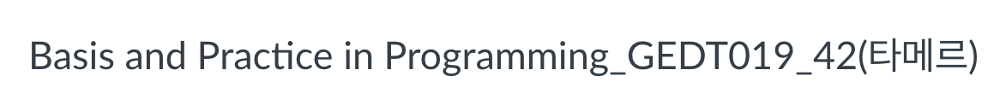
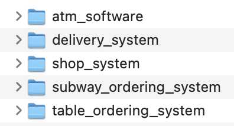
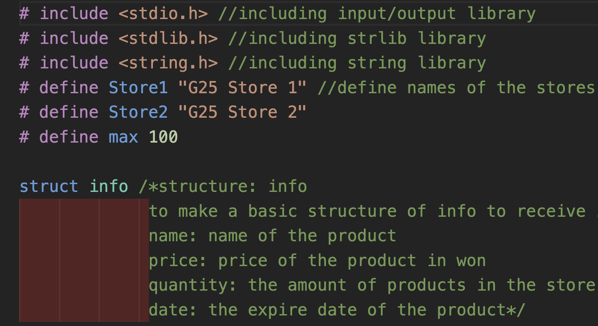
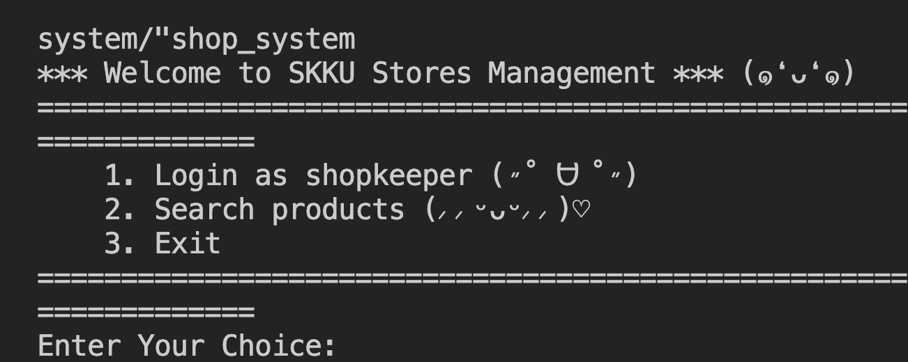

<div align="center">

  
  <h1>C Programming: Basis and Practice in Programming</h1>
  
  <p>
    Projects in a C Programming course.
  </p>
  
  
<!-- Badges -->
<p>
  <a href="https://github.com/aptheparker/c-skku-basic_programming/graphs/contributors">
    
  </a>
  <a href="">
    
  </a>
  <a href="https://github.com/aptheparker/c-skku-basic_programming/network/members">
    
  </a>
  <a href="https://github.com/aptheparker/c-skku-basic_programming/stargazers">
    
  </a>
  <a href="https://github.com/aptheparker/c-skku-basic_programming/issues/">
    
  </a>
  <a href="https://github.com/aptheparker/c-skku-basic_programming/blob/master/LICENSE">
    
  </a>
</p>
   
<h4>
    <a href="https://github.com/aptheparker/c-skku-basic_programming/">View Demo</a>
  <span> · </span>
    <a href="https://github.com/aptheparker/c-skku-basic_programming">Documentation</a>
  <span> · </span>
    <a href="https://github.com/aptheparker/c-skku-basic_programming/issues/">Report Bug</a>
  <span> · </span>
    <a href="https://github.com/aptheparker/c-skku-basic_programming/issues/">Request Feature</a>
  </h4>
</div>

<br />

<!-- About the Project -->

## :star2: About the Project

<!-- Screenshots -->

### :camera: Screenshots

<div align="center"> 
  
</div>

<div align="center"> 
  
</div>

<div align="center"> 
  
</div>

<!-- Usage -->

### :eyes: Usage

Mini projects with C language:

<ul>
  <li>atm_software</li>
  <li>delivery_system</li>
  <li>shop_system</li>
  <li>subway_ordering_system</li>
  <li>table_ordering_system</li>
</ul>

<!-- TechStack -->

## :space_invader: Tech Stack

<details>
<summary>Language</summary>
  <ul>
    <li><a href="https://www.cprogramming.com/">C</a></li>
  </ul>
</details>

<!-- Getting Started -->

## :toolbox: Getting Started

Clone the project

```bash
  git clone https://github.com/aptheparker/c-skku-basic_programming.git
```

<!-- Contributing -->

## :wave: Contributing

<a href="https://github.com/aptheparker/c-skku-basic_programming/graphs/contributors">
  
</a>

Contributions are always welcome!

<ol>
  <li>Fork the Project</li>
  <li>Create your Feature Branch (git checkout -b feature/AmazingFeature)</li>
  <li>Commit your Changes (git commit -m 'Add some AmazingFeature')</li>
  <li>Push to the Branch (git push origin feature/AmazingFeature)</li>
  <li>Open a Pull Request</li>
</ol>

<!-- Contact -->

## :handshake: Contact

Your Name - [@instagram](https://www.instagram.com/aptheparker) - aptheparker@gmail.com

Project Link: [https://github.com/aptheparker/c-skku-basic_programming](https://github.com/aptheparker/c-skku-basic_programming)
